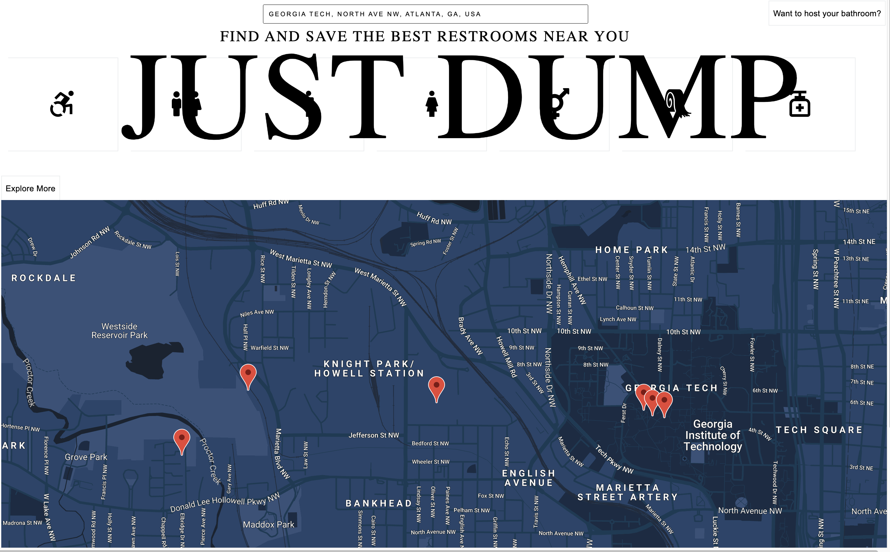
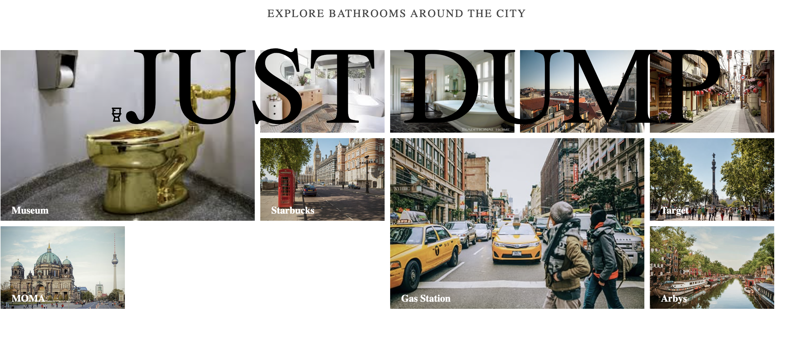
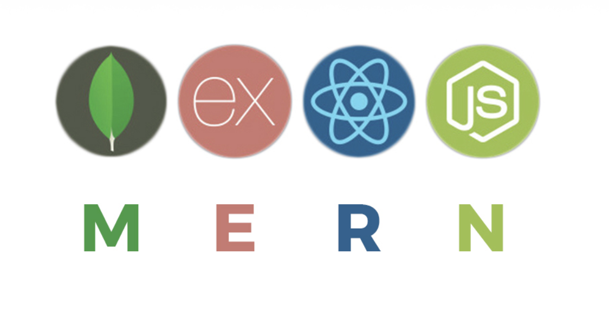

## Just Dump

 


### About
*Just Dump* is a web app that allows users to easily find public restrooms near them. My main motivation for developing this app was to make sure everybody has equal access to public restrooms.


### Tech Stack
*Just Dump* was built using ReactJS on the front end and Node/Express with MongoDB on the back end.




NPM Packages used:
* @react-google-maps/api
* use-places-autocomplete

Keys APIs used:
* Geocoding API
* Maps Javascript API
* Places API


### User Stories
* User should be able to search for a bathroom using the search bar.
* User should be able to mark a location once they use a restroom at that location.
* User should be able to click on a marker and leave a feedback once they use a public restroom at a specific location

### Project Setup
* After cloning this repo, run ```npm install``` from within the root directory of this project.
* Please create a Google Map API Key, and ensure that the two services below are enabled. Create a file in the root directory called ```config.js```. Copy and paste the following code into the newly created file:

             var GOOGLE_MAPS_API_KEY = <YOUR GOOGLE MAP API KEY>;
             export default GOOGLE_MAPS_API_KEY;

* Run ```npm react-dev``` to bundle webpack which watches for code changes automatically for you.

### Future Scope

* Users should easily be able to filter restrooms based on their preference
* Users should be able to share real-time information that translates into current bathroom cleanliness, lines etc.
* Users should be able able to host their bathroom for free or charge a reasonable price.

